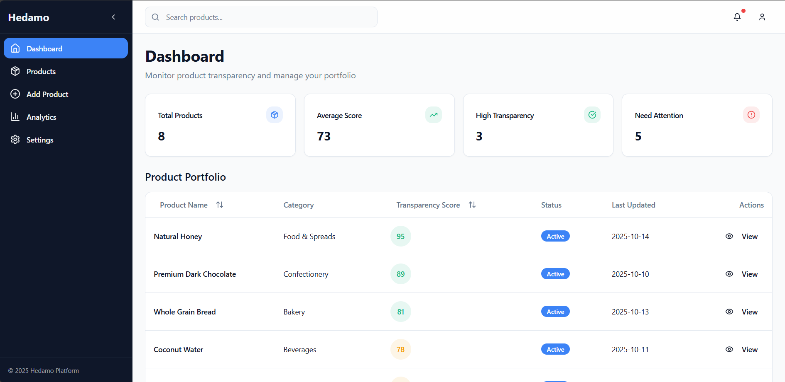

# 🌟 Hedamo Platform

**AI-Powered Product Transparency Dashboard**

A comprehensive product management system that empowers producers to track transparency scores, manage certifications, and receive AI-driven insights for better product compliance and quality assurance.

---

## 🚀 Live Demo

**[View Live Application →](https://your-app-url.vercel.app)**

> _Deploy to Vercel to get your live URL_

---

## ✨ Key Features

| Feature                   | Description                                                                                       |
| ------------------------- | ------------------------------------------------------------------------------------------------- |
| 📊 **Dashboard Overview** | Real-time metrics displaying transparency scores, active products, and issues requiring attention |
| 🔍 **Product Management** | Advanced filtering, sorting, and search capabilities across your entire product catalog           |
| 📈 **AI Analytics**       | Visual score breakdowns with interactive charts and performance insights by category              |
| 🎯 **Smart Suggestions**  | AI-powered recommendations to improve product transparency and compliance                         |
| ⚠️ **Risk Flags**         | Automatic detection of compliance issues, missing information, and verification gaps              |
| ➕ **Multi-Step Forms**   | Intuitive 4-step product submission workflow with progress tracking                               |
| 📱 **Fully Responsive**   | Seamless experience across desktop, tablet, and mobile devices                                    |
| 🎨 **Modern UI/UX**       | Clean, professional interface built with Tailwind CSS and shadcn/ui components                    |

---

## 📸 Application Screenshots

### 🏠 Dashboard Overview


_Main dashboard featuring key metrics: Total Products (8), Average Score (73), High Transparency count (3), and products needing attention (5). Includes a sortable product portfolio table with color-coded transparency scores._

---

### 📦 Product Management


_Comprehensive product listing with advanced filters. Search by name, filter by status (Active/Pending/Draft), and category. Shows 8 products with color-coded scores ranging from 95 (green) to 44 (red)._

---

### ➕ Add Product Flow


_Multi-step product submission wizard with 4 stages: Basic Info → Ingredients → Certifications → Review. Clean form design with progress indicators and validation._

---

### 📊 Analytics Dashboard


_Comprehensive analytics showing:_

- _Average portfolio score: 73_
- _Total issues across products: 6_
- _Verified certifications: 13_
- _Category performance breakdown_
- _Most common issues ranked by frequency_

---

### ⚙️ Settings - Profile Management


_User profile settings including personal information, notification preferences with toggle switches, and security options._

---

### 🔐 Settings - Security & Privacy


_Security settings for password management and data privacy controls. Includes options to export data and manage account deletion._

---

## 🛠️ Tech Stack

```
Frontend:      React 18.3.1 + TypeScript 5.8.3
Build Tool:    Vite 5.4.19
Styling:       Tailwind CSS 3.4.17
UI Library:    shadcn/ui (Radix UI components)
Routing:       React Router v6.30.1
Charts:        Recharts 2.15.4
Icons:         Lucide React 0.462.0
Forms:         React Hook Form 7.61.1
Notifications: Sonner 1.7.4
Deployment:    Vercel
```

---

## 🏃 Quick Start

### Prerequisites

- **Node.js** 18+ or **Bun**
- **Git**

### Installation

```bash
# Clone the repository
git clone https://github.com/YOUR_USERNAME/hedamo-platform.git

# Navigate to project directory
cd hedamo-platform

# Install dependencies
npm install

# Start development server
npm run dev
```

Open **http://localhost:8080** in your browser.

---

## 📦 Available Scripts

| Command           | Description                      |
| ----------------- | -------------------------------- |
| `npm run dev`     | Start development server (Vite)  |
| `npm run build`   | Build for production             |
| `npm run preview` | Preview production build locally |
| `npm run lint`    | Run ESLint for code quality      |

---

## 🏗️ Build & Deploy

### Local Production Build

```bash
# Build the application
npm run build

# Preview production build
npm run preview
```

The build output will be in the `dist` folder.

### Deploy to Vercel

**Option 1: Vercel Dashboard** (Recommended)

1. Push your code to GitHub
2. Go to [vercel.com/new](https://vercel.com/new)
3. Import your repository
4. Vercel auto-detects Vite settings
5. Click "Deploy"

**Option 2: Vercel CLI**

```bash
# Install Vercel CLI
npm i -g vercel

# Deploy to production
vercel --prod
```

---

## 📁 Project Structure

```
hedamo-platform/
├── src/
│   ├── components/
│   │   ├── ui/                     # shadcn/ui components (40+ components)
│   │   ├── Navbar.tsx              # Top navigation bar with search
│   │   ├── Sidebar.tsx             # Collapsible sidebar navigation
│   │   ├── ProductTable.tsx        # Sortable product table
│   │   ├── ProductDetailModal.tsx  # Product details with AI insights
│   │   └── RadialChart.tsx         # Score visualization component
│   ├── pages/
│   │   ├── Dashboard.tsx           # Main dashboard with stats
│   │   ├── Products.tsx            # Product management & filtering
│   │   ├── AddProduct.tsx          # Multi-step product form
│   │   ├── Analytics.tsx           # Analytics & insights
│   │   ├── Settings.tsx            # User settings & preferences
│   │   ├── Index.tsx               # Layout wrapper
│   │   └── NotFound.tsx            # 404 page
│   ├── data/
│   │   └── products.json           # Mock product data (8 products)
│   ├── hooks/
│   │   ├── use-mobile.tsx          # Mobile detection hook
│   │   └── use-toast.ts            # Toast notifications hook
│   ├── lib/
│   │   └── utils.ts                # Utility functions (cn, etc.)
│   ├── App.tsx                     # Root component with routing
│   ├── main.tsx                    # Application entry point
│   └── index.css                   # Global styles & Tailwind imports
├── public/
│   ├── favicon.ico
│   ├── placeholder.svg
│   └── robots.txt
├── screenshots/                    # Application screenshots
├── index.html                      # HTML entry point
├── tailwind.config.ts              # Tailwind configuration
├── vite.config.ts                  # Vite configuration
├── tsconfig.json                   # TypeScript configuration
└── package.json                    # Dependencies & scripts
```

---

## 🎨 Design Decisions

### Component Architecture

- **Modular Design:** Reusable components following atomic design principles
- **shadcn/ui Integration:** 40+ pre-built, customizable Radix UI components
- **Type Safety:** Full TypeScript implementation with strict typing
- **Composition Pattern:** Components built for maximum reusability

### User Experience

- **Color-Coded Scoring System:**
  - 🟢 **Green (80-100):** Excellent transparency
  - 🟡 **Yellow (60-79):** Good, needs minor improvements
  - 🔴 **Red (0-59):** Needs significant attention
- **Progressive Disclosure:** Details revealed on-demand via modals
- **Mobile-First Design:** Responsive layouts that adapt to all screen sizes
- **Intuitive Navigation:** Collapsible sidebar with icon-only collapsed state

### Performance Optimization

- **Code Splitting:** Lazy loading for optimal bundle sizes
- **Mock API Simulation:** Realistic data fetching with setTimeout (300-500ms)
- **Fast Refresh:** Vite HMR for instant development feedback
- **Optimized Builds:** Tree-shaking and minification enabled

---

## 📊 Mock Data Structure

Products follow this AI-response format for consistency:

```json
{
  "id": "prod-001",
  "productName": "Organic Herbal Tea",
  "category": "Beverages",
  "score": 72,
  "status": "active",
  "lastUpdated": "2025-10-12",
  "explanation": "Moderate transparency. Missing sourcing details for 2 ingredients.",
  "suggestions": [
    "Add sourcing details for green tea leaves",
    "Include certification ID for 'organic' claim",
    "Clarify packaging recyclability"
  ],
  "flags": ["Incomplete sourcing", "Unverified organic claim"],
  "ingredients": [
    {
      "name": "Green Tea Leaves",
      "source": "Unknown",
      "verified": false
    },
    {
      "name": "Chamomile",
      "source": "Germany",
      "verified": true
    }
  ],
  "certifications": ["Organic", "Fair Trade"]
}
```

**Current Dataset:** 8 sample products across 6 categories (Beverages, Confectionery, Food & Spreads, Bakery, Supplements, Oils & Condiments)

---

## 🎯 Core Features Explained

### Dashboard Page

- **Total Products:** Complete count of products in your catalog
- **Average Score:** Mean transparency score across all products
- **High Transparency:** Products scoring 80 or above (excellent)
- **Need Attention:** Products with risk flags requiring action
- **Product Portfolio Table:** Sortable, color-coded product listing

### Product Management

- **Search:** Real-time filtering by product name or category
- **Status Filter:** View Active, Pending, or Draft products
- **Category Filter:** Dynamic dropdown with all available categories
- **Sorting:** Click any column header to sort ascending/descending
- **Result Count:** Shows "Showing X of Y products"

### Product Detail Modal

- **Radial Score Chart:** Visual transparency score (0-100)
- **AI Explanation:** Natural language analysis of the score
- **Smart Suggestions:** Actionable recommendations with icons
- **Risk Flags:** Color-coded warnings for compliance issues
- **Ingredients List:** Complete ingredient breakdown with sources
- **Certifications:** All quality and compliance badges

### AI Analytics Page

- **Portfolio Metrics:** Average score, total issues, certifications, categories
- **Category Performance:** Horizontal bar charts showing scores by category
- **Issue Tracking:** Most common problems ranked by frequency
- **Trend Analysis:** Visual insights into product portfolio health

### Multi-Step Product Form

1. **Basic Info:** Product name (required), category (dropdown), description
2. **Ingredients:** Add/remove ingredients with source verification
3. **Certifications:** Tag certifications (Organic, Fair Trade, etc.)
4. **Review:** Preview all entered data before submission
5. **AI Feedback:** Mock AI analysis displayed via toast notification

### Settings

- **Profile Management:** Name, email, company information
- **Notifications:** Toggle email alerts, product alerts, weekly reports
- **Security:** Password change functionality
- **Data & Privacy:** Export data, data sharing toggle, account deletion

---

## 🔮 Future Enhancements

### Planned Features

- [ ] **Dark Mode Toggle** - Theme switching with persistence
- [ ] **Real Backend API** - Integration with Node.js/Express or similar
- [ ] **User Authentication** - Login, registration, JWT tokens
- [ ] **Data Export** - CSV and PDF export functionality
- [ ] **Bulk Operations** - Multi-select and batch actions
- [ ] **Advanced Analytics** - Trend lines, historical data, predictions
- [ ] **Email Notifications** - Real email alerts via SendGrid/Mailgun
- [ ] **Multi-language Support** - i18n implementation
- [ ] **File Upload** - Product images and certification documents
- [ ] **Collaboration Features** - Team accounts, role-based access

### Technical Improvements

- [ ] **React Query Integration** - Better data fetching and caching
- [ ] **Zod Form Validation** - Schema-based form validation
- [ ] **Framer Motion** - Smooth page transitions and animations
- [ ] **PWA Support** - Offline functionality and app-like experience
- [ ] **Unit Tests** - Jest + React Testing Library
- [ ] **E2E Tests** - Playwright or Cypress testing
- [ ] **Storybook** - Component documentation and testing
- [ ] **Performance Monitoring** - Web Vitals tracking

---

## 🤝 Contributing

Contributions are welcome! Please follow these steps:

1. Fork the repository
2. Create a feature branch (`git checkout -b feature/amazing-feature`)
3. Commit your changes (`git commit -m 'Add amazing feature'`)
4. Push to the branch (`git push origin feature/amazing-feature`)
5. Open a Pull Request

### Coding Standards

- Use TypeScript for all new files
- Follow existing code style (ESLint configuration)
- Add comments for complex logic
- Update README if adding new features

---

## 📄 License

This project is licensed under the **MIT License**.

---

## 🙏 Acknowledgments

- **UI Components:** [shadcn/ui](https://ui.shadcn.com/) - Beautiful, accessible component library
- **Icons:** [Lucide React](https://lucide.dev/) - Pixel-perfect icon set
- **Charts:** [Recharts](https://recharts.org/) - Composable charting library
- **Styling:** [Tailwind CSS](https://tailwindcss.com/) - Utility-first CSS framework
- **Build Tool:** [Vite](https://vitejs.dev/) - Next generation frontend tooling

---

## 👨‍💻 Author

**Your Name**

- GitHub: [@your-username](https://github.com/your-username)
- LinkedIn: [Your LinkedIn](https://linkedin.com/in/your-profile)
- Email: your.email@example.com

---

<div align="center">

**[⬆ Back to Top](#-hedamo-platform)**

Made with ❤️ for transparent product management

© 2025 Hedamo Platform

</div>
